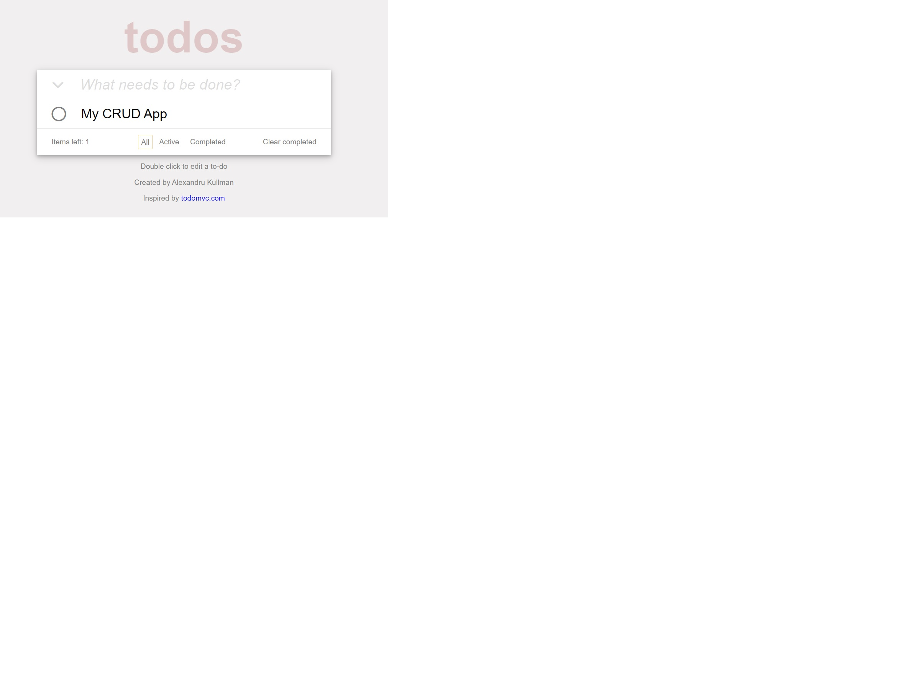

# ToDoList-App

## Description

My final project for Hackademy Web101 Course. A CRUD application that allows the user
to organise his tasks better.

**Technologies used**: *HTML*, *CSS*, *JavaScript*

*Inspired by*: [ToDoMVC](https://todomvc.com/)

## Implementation and functionality

The user must enter a task name and press enter key to add it to the list.
If the input is empty, a *warning message* will be displayed.

All tasks can be *filtered* by their status, active or completed. The interface
allows the user to select all tasks by clicking the down arrow from the left
of the input box. A *checkbox* and a cross (delete) button is assigned to each
new task to mark it as completed or remove it from the list. Double-clicking on
an element will transform the label into an input element, making it editable.
Additionally, completed tasks may be deleted by selecting the button in the
bottom right corner.

I have used *event listeners* for each item to track user's actions. All changes are
persistent because of the *local storage*. A list of *JSON object* are stored, each 
object containing the name and the status of a task.

