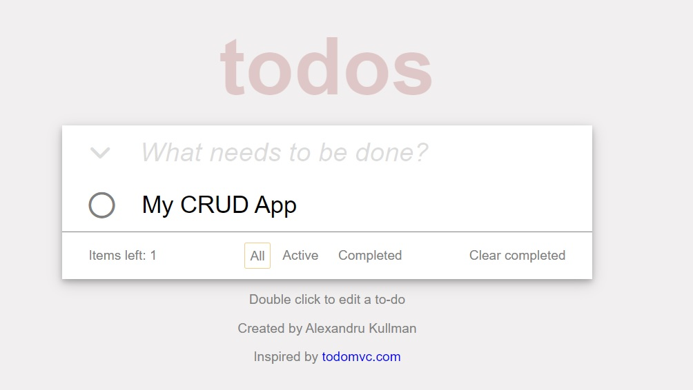

<!-- PROJECT LOGO -->
<br />
<div align="left">

  <h1 align="center" id="readme-top">ToDo List App</h1>

<div align="center">
 <a href="https://github.com/alexk1923/ToDoList-App">
  
  </a>
</div>

<!-- ABOUT THE PROJECT -->
## About The Project

My final project for Hackademy Web101 Course. A simple **CRUD** application that allows the user to organise his tasks better.

Deployed with Github Pages: <a href="https://alexk1923.github.io/ToDoList-App/">ToDoList App</a>

    
## Functionality

- The user must enter a task name and press enter key to add it to the list. If the input is empty, a warning message will be displayed.

- All tasks can be filtered by their status, active or completed.
The interface allows the user to select all tasks by clicking the down arrow from the left of the input box.

- Completion of a task can be marked by clicking the checkbox, removal can be performed if the cross button on the right is clicked.

- **Double-clicking** on an element will transform the label into an input element, making it editable. Additionally, completed tasks may be deleted by selecting the button in the bottom right corner.

- I have used **event listeners** for each item to track user's actions. All changes are persistent because of the **local storage**. A list of **JSON** object are stored, each object containing the name and the status of a task.

<p align="right">(<a href="#readme-top">back to top</a>)</p>


### Built With

* ![HTML][HTML]
* ![CSS][CSS]
* [![Javascript][Javascript]][Javascript-url]

<p align="right">(<a href="#readme-top">back to top</a>)</p>


<!-- GETTING STARTED -->
## Getting Started


### How to run the app


1. Clone the repo
   ```sh
   git clone git@github.com:alexk1923/ToDoList-App.git
   ```
2. Open index.html


<p align="right">(<a href="#readme-top">back to top</a>)</p>


<!-- MARKDOWN LINKS & IMAGES -->
<!-- https://www.markdownguide.org/basic-syntax/#reference-style-links -->
[contributors-shield]: https://img.shields.io/github/contributors/othneildrew/Best-README-Template.svg?style=for-the-badge
[contributors-url]: https://github.com/othneildrew/Best-README-Template/graphs/contributors
[forks-shield]: https://img.shields.io/github/forks/othneildrew/Best-README-Template.svg?style=for-the-badge
[forks-url]: https://github.com/othneildrew/Best-README-Template/network/members
[stars-shield]: https://img.shields.io/github/stars/othneildrew/Best-README-Template.svg?style=for-the-badge
[stars-url]: https://github.com/othneildrew/Best-README-Template/stargazers
[issues-shield]: https://img.shields.io/github/issues/othneildrew/Best-README-Template.svg?style=for-the-badge
[issues-url]: https://github.com/othneildrew/Best-README-Template/issues
[license-shield]: https://img.shields.io/github/license/othneildrew/Best-README-Template.svg?style=for-the-badge
[license-url]: https://github.com/othneildrew/Best-README-Template/blob/master/LICENSE.txt
[linkedin-shield]: https://img.shields.io/badge/-LinkedIn-black.svg?style=for-the-badge&logo=linkedin&colorB=555
[linkedin-url]: https://linkedin.com/in/othneildrew
[product-screenshot]: images/screenshot.png
[Next.js]: https://img.shields.io/badge/next.js-000000?style=for-the-badge&logo=nextdotjs&logoColor=white
[Next-url]: https://nextjs.org/
[React.js]: https://img.shields.io/badge/React-20232A?style=for-the-badge&logo=react&logoColor=61DAFB
[React-url]: https://reactjs.org/
[Vue.js]: https://img.shields.io/badge/Vue.js-35495E?style=for-the-badge&logo=vuedotjs&logoColor=4FC08D
[Vue-url]: https://vuejs.org/
[Angular.io]: https://img.shields.io/badge/Angular-DD0031?style=for-the-badge&logo=angular&logoColor=white
[Angular-url]: https://angular.io/
[Svelte.dev]: https://img.shields.io/badge/Svelte-4A4A55?style=for-the-badge&logo=svelte&logoColor=FF3E00
[Svelte-url]: https://svelte.dev/
[Laravel.com]: https://img.shields.io/badge/Laravel-FF2D20?style=for-the-badge&logo=laravel&logoColor=white
[Laravel-url]: https://laravel.com
[Bootstrap.com]: https://img.shields.io/badge/Bootstrap-563D7C?style=for-the-badge&logo=bootstrap&logoColor=white
[Bootstrap-url]: https://getbootstrap.com
[JQuery.com]: https://img.shields.io/badge/jQuery-0769AD?style=for-the-badge&logo=jquery&logoColor=white
[JQuery-url]: https://jquery.com 
[Typescript]: https://img.shields.io/badge/TypeScript-007ACC?style=for-the-badge&logo=typescript&logoColor=white
[Typescript-url]: https://www.typescriptlang.org/
[Express]: https://img.shields.io/badge/Express.js-404D59?style=for-the-badge
[Express-url]: http://expressjs.com/
[SASS]:https://img.shields.io/badge/Sass-CC6699?style=for-the-badge&logo=sass&logoColor=white
[SASS-url]:https://sass-lang.com/
[C]:https://img.shields.io/badge/C-00599C?style=for-the-badge&logo=c&logoColor=white
[C-url]:https://www.w3schools.com/c/c_intro.php
[Javascript]: https://img.shields.io/badge/JavaScript-F7DF1E?style=for-the-badge&logo=javascript&logoColor=black
[Javascript-url]: https://developer.mozilla.org/en-US/docs/Web/JavaScript
[HTML]: https://img.shields.io/badge/HTML5-E34F26?style=for-the-badge&logo=html5&logoColor=white
[CSS]: https://img.shields.io/badge/CSS3-1572B6?style=for-the-badge&logo=css3&logoColor=white
